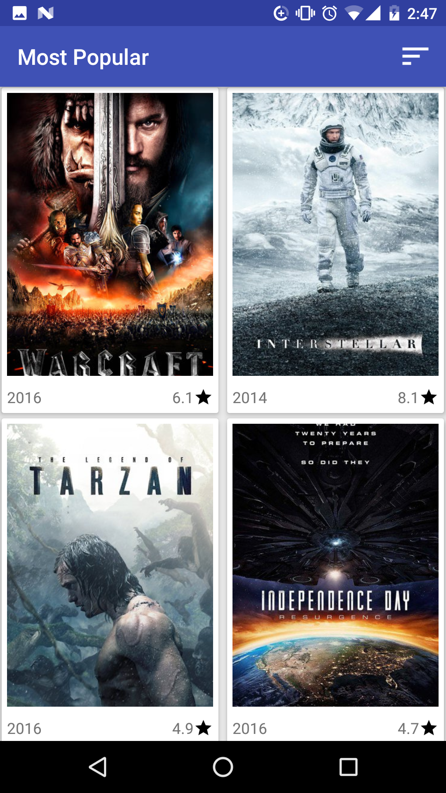
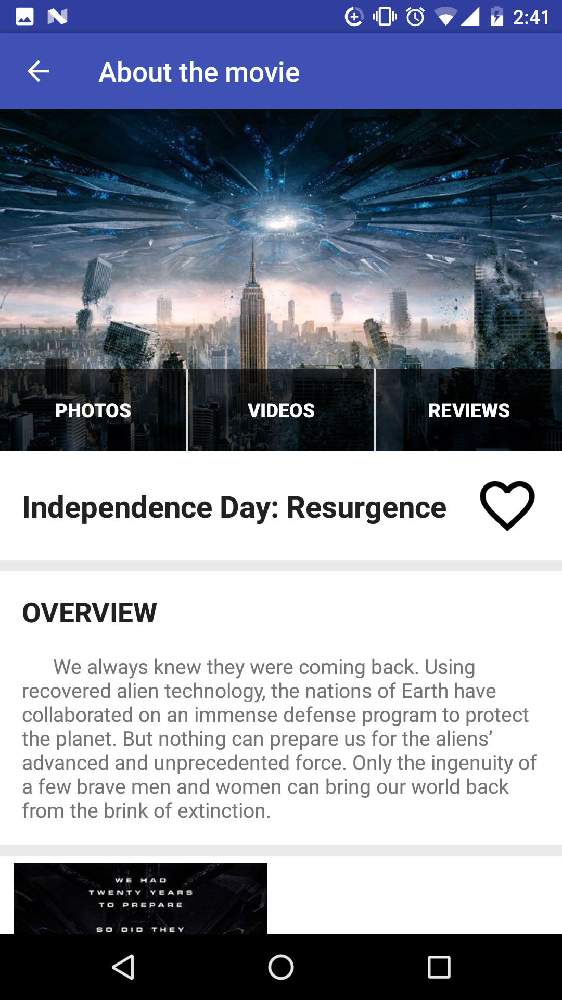
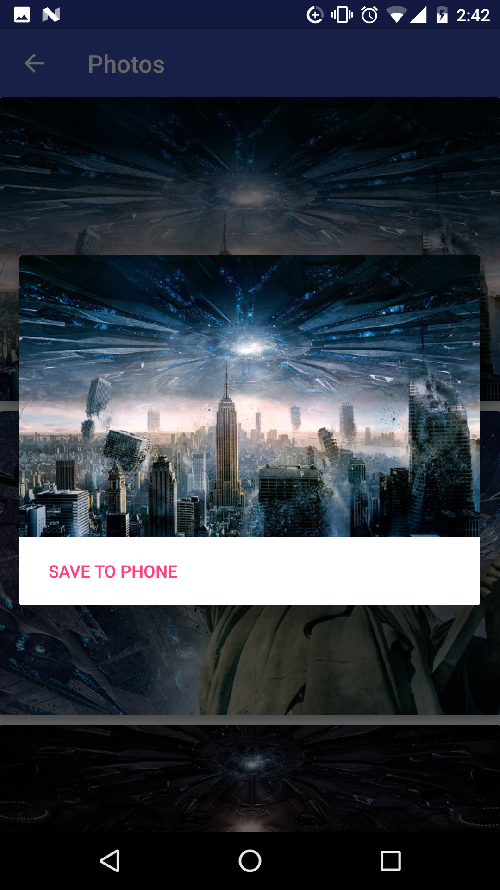
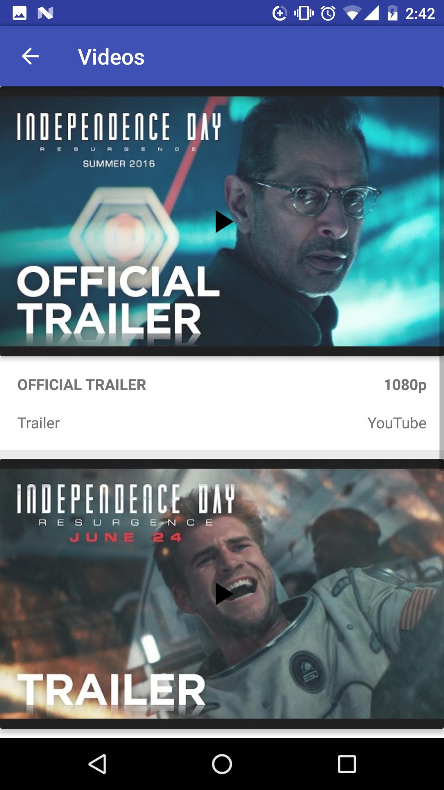
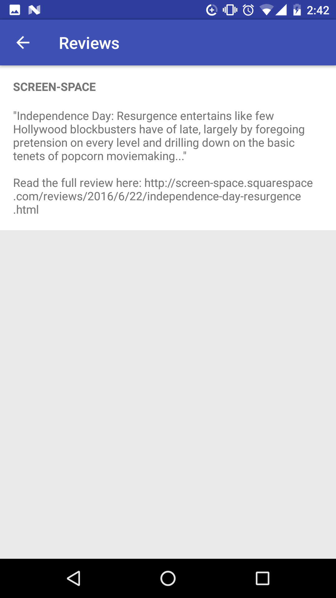
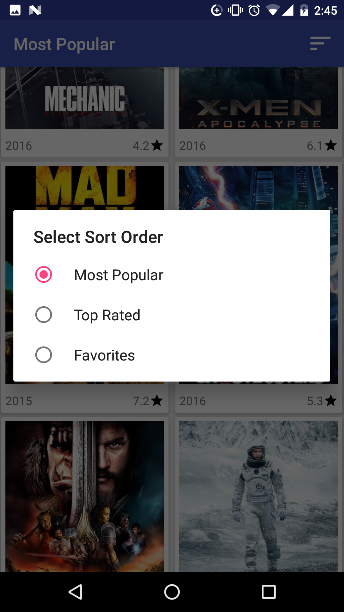
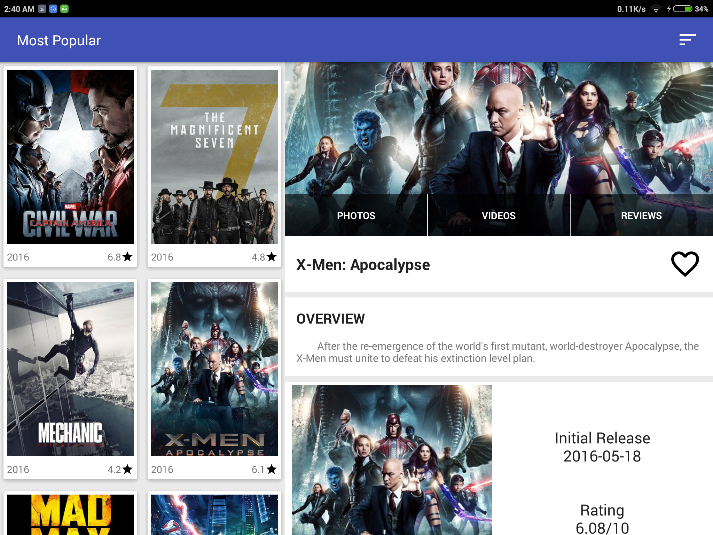
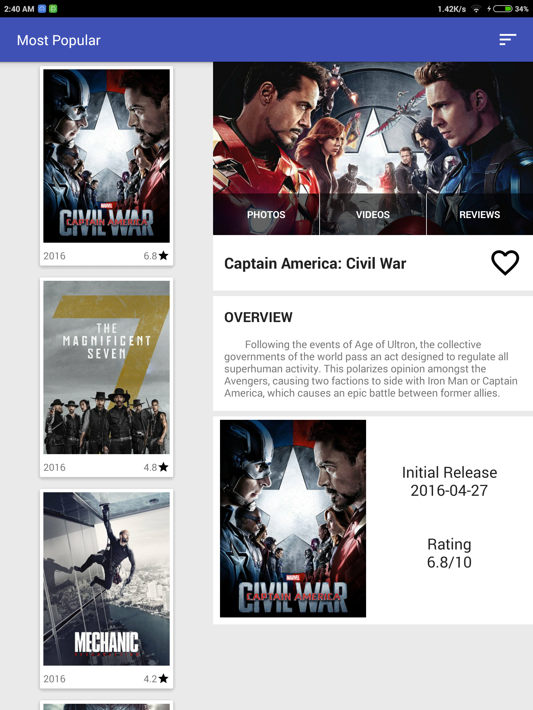

# PopularMovies

This is a project for the Android Nano-degree Course at Udacity.

The Api Key needs to be added to app/src/main/res/strings.xml.

Install PopularMovies.apk to try the app.

Phone Screenshots:

&nbsp;&nbsp;&nbsp;&nbsp;&nbsp;&nbsp;&nbsp;&nbsp;&nbsp;&nbsp;&nbsp;&nbsp;

&nbsp;&nbsp;&nbsp;&nbsp;&nbsp;&nbsp;&nbsp;&nbsp;&nbsp;&nbsp;&nbsp;&nbsp; 

Tablet Screenshots:

 

